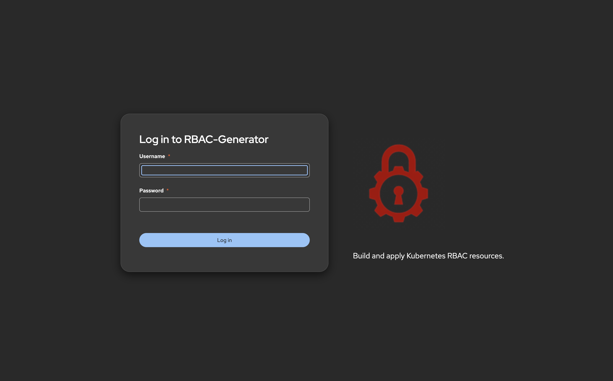
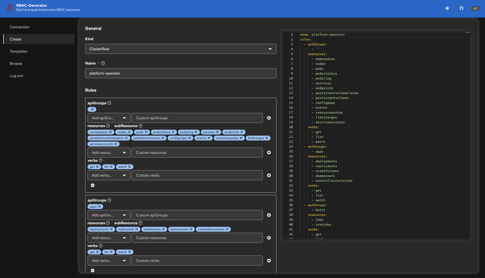

# RBAC-Generator

A small tool for building Kubernetes/OpenShift `Role`, `ClusterRole`,
`RoleBinding`, and `ClusterRoleBinding` resources through a guided PatternFly 6 UI,
instead of hand-writing YAML. Optionally connects to a live cluster (via a
pasted/uploaded kubeconfig, held only in memory for the session) to validate with
a server-side dry-run, apply resources directly, and browse existing ones read-only.

## Features

- Guided rule builder for all four RBAC kinds, with cascading, searchable
  apiGroups → resources → subResources → verbs dropdowns, backed by live API
  discovery (with Custom Resources called out separately from built-ins) or a
  built-in static catalog when offline.
- Persistent, always-on split-pane Form ⇄ YAML view: edit either side and the
  other updates live, with debounced parsing and inline error feedback for
  invalid YAML.
- **Templates**: one-click persona starting points (Cluster-Admin,
  Cluster-Viewer, VirtualMachine-Admin, VirtualMachine-Viewer,
  Platform-Operator, Network-Engineer) that pre-fill the Create page as
  either a ClusterRole or a namespaced Role — nothing is applied until you
  review, dry-run, and confirm.
- When connected to a cluster: live API discovery, ServiceAccount lookup,
  server-side dry-run validation, and direct apply.
- Read-only Browse view for existing Roles/ClusterRoles/RoleBindings/ClusterRoleBindings,
  with one-click copy of the resource's YAML.
- Light/dark mode toggle, with the YAML editor's theme following it.
- Simple built-in login (PatternFly6 `LoginPage`) backed by a single shared,
  env-configured, bcrypt-hashed credential.
- Ships as a single container image, built entirely from Red Hat UBI9 images.

## Screenshots

| Login | Create |
| --- | --- |
|  |  |

## Authentication

The app has a single username/password, set via the `APP_USERNAME` and
`APP_PASSWORD_HASH` environment variables — there's no user database. The
plaintext password itself is never stored or passed to the app; instead you
generate a [bcrypt](https://en.wikipedia.org/wiki/Bcrypt) hash of it once,
and give the app *that hash*.

**1. Generate the hash.** `make hash-password` runs a small Go helper
(`backend/cmd/hashpw`) that prints a bcrypt hash of the password you pass in:

```bash
make hash-password PASSWORD=yourpassword
```

This prints something like:

```
$2a$10$N9qo8uLOickgx2ZMRZoMyeIjZAgcfl7p92ldGxad68LJZdL17lhWy
```

**2. Put that hash into `APP_PASSWORD_HASH`.** You'll see this written two
ways in this README — they do the same thing:

- **Explicit (do this if the one-liner below is confusing):** run the
  command above, copy the hash it prints, and paste it in yourself:
  ```bash
  export APP_PASSWORD_HASH='$2a$10$N9qo8uLOickgx2ZMRZoMyeIjZAgcfl7p92ldGxad68LJZdL17lhWy'
  ```
- **One-liner shortcut:** `$(...)` is a shell feature called *command
  substitution* — it runs whatever command is inside the parentheses and
  replaces `$(...)` with that command's printed output. So
  `APP_PASSWORD_HASH="$(make hash-password PASSWORD=yourpassword)"` runs step
  1 and immediately stores its printed hash into `APP_PASSWORD_HASH` for you,
  without a manual copy/paste:
  ```bash
  export APP_PASSWORD_HASH="$(make hash-password PASSWORD=yourpassword)"
  ```

Either way works — use whichever you find clearer. `APP_USERNAME` is just a
plain string (e.g. `admin`), no hashing needed.

## Local development

```bash
# Backend
export APP_USERNAME=admin
export APP_PASSWORD_HASH="$(make hash-password PASSWORD=yourpassword)"
cd backend && go run ./cmd/server

# Frontend (separate terminal)
cd frontend && npm run dev
```

## Running the tests

```bash
make test          # backend (Go)
cd frontend && npm test   # frontend (Vitest)
```

## Building the container image

```bash
make image                # builds rbac-generator:v1.0 (VERSION defaults to v1.0)
make image VERSION=v1.2.3 # or override the tag explicitly for a new release
```

This builds `rbac-generator:v1.0` using a multi-stage `Containerfile` where
every stage is a Red Hat UBI9 image. The image tag always matches the app's
release version (`frontend/package.json` and the version badge in the
masthead) — `latest` is never used, so a running container's version is
always explicit and reproducible. When cutting a new release, bump the
version in `frontend/package.json`, the `APP_VERSION` constant in
`frontend/src/App.tsx`, and `deploy/kustomize/base/deployment.yaml` together
with the `make image VERSION=...` tag.

- `registry.access.redhat.com/ubi9/nodejs-22` — builds the frontend.
- `registry.access.redhat.com/ubi9/go-toolset:1.25` — builds the Go backend and
  embeds the frontend build output via `go:embed`. Pinned to the `1.25` tag so the
  toolchain always matches `backend/go.mod`'s `go 1.25.0` directive (the untagged
  `:latest` image can ship a newer/older Go release).
- `registry.access.redhat.com/ubi9/ubi-micro` — final runtime, containing only the
  compiled static binary (no shell, no package manager).

To use an enterprise/authenticated mirror instead of the free `registry.access.redhat.com`
images, swap each `FROM` line to the equivalent `registry.redhat.io/ubi9/...` image
(requires `podman login registry.redhat.io` first).

## Running the container

`make hash-password` (used below) isn't a standalone binary — it's a
Makefile target that builds and runs the `backend/cmd/hashpw` Go program, so
you need a clone of this repository (not just the container image) to run
it:

```bash
git clone https://github.com/rguske/rbac-generator.git
cd rbac-generator
```

See [Authentication](#authentication) above for what `APP_USERNAME` /
`APP_PASSWORD_HASH` mean and where the hash comes from.

```bash
podman run --rm -p 8080:8080 \
  -e APP_USERNAME=admin \
  -e APP_PASSWORD_HASH="$(make hash-password PASSWORD=yourpassword)" \
  rbac-generator:v1.0
```

Then open http://localhost:8080 and log in with `admin` / `yourpassword`
(or whatever username/password you generated the hash for).

## Deploying to OpenShift/Kubernetes

Base manifests live under `deploy/kustomize/base/` (Deployment, Service, Route).
On vanilla Kubernetes (no Route CRD), remove `route.yaml` from
`kustomization.yaml` and add your own `Ingress` instead.

1. Copy `deploy/kustomize/base/secret.example.yaml` to
   `deploy/kustomize/base/secret.yaml` (already gitignored) and fill in real
   values (`APP_PASSWORD_HASH` from `make hash-password`).
2. Apply the secret: `kubectl apply -f deploy/kustomize/base/secret.yaml`
3. Apply the base: `kubectl apply -k deploy/kustomize/base`

## Security notes

- Kubeconfig text is held only in memory for the duration of a session and is
  never written to disk or logged.
- This tool assumes a trusted network / internal deployment. It is not intended
  to be exposed directly to the public internet without an additional
  reverse-proxy/auth layer.
- v1 does not support editing or deleting existing RBAC resources — Browse is
  read-only.

## Design & implementation history

- Design spec: `docs/superpowers/specs/2026-08-29-rbac-generator-design.md`
- Implementation plan: `docs/superpowers/plans/2026-08-29-rbac-generator.md`
- v1.1 design spec (Templates, discovery, branding, split-pane YAML view):
  `docs/superpowers/specs/2026-08-29-discovery-rulebuilder-branding-design.md`
- v1.1 implementation plan: `docs/superpowers/plans/2026-08-29-discovery-rulebuilder-branding.md`

## License

Licensed under the Apache License, Version 2.0 - see [LICENSE](LICENSE) for details.
